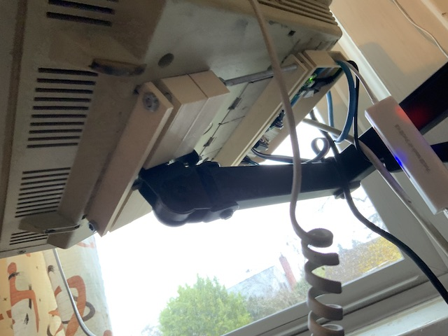

# open_scad_stuff
A place to make things in scad.

## pipe_clamp.scad/screwey.scad
I needed to stablilize a vesa arm to mount my vt320.

## vt320_stand.scad

So then I needed to mount the vt320 and the networked raspberry pi onto the mount.

